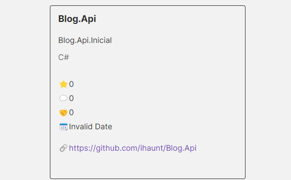

# Github-Finder

Usando funções para consumação de API e gerar busca. (Frontend)

## 📱 Funcionalidades: 
Consiste em um APP que recupera informações de usuários do github, passando o nome de usuário como parâmetro, retornando os dados como por exemplo: name; login; public repos...

## 🤳 Demonstração:
- Você pode clicar no link abaixo e testar:

  [Github Finder](https://ihaunt.github.io/Github-Finder/)

## 👩🏻‍💻 Imagem do projeto:

!
!

## 🤖 Tecnologias Utilizadas:

- NodeJs Versão LTS Mais Recente: 18.18.0 (includes npm 9.8.1)
- Package Http-server
- Css
- HTML
- JavaScript

## 👣 Próximos Passos:
- [] Melhorias na aparencia em CSS
 
obs: Essa api realiza bloqueios quando seu uso é exessivo em um determinado IP. Caso aconteça, aguarde em torno de 2hs e volte a usar